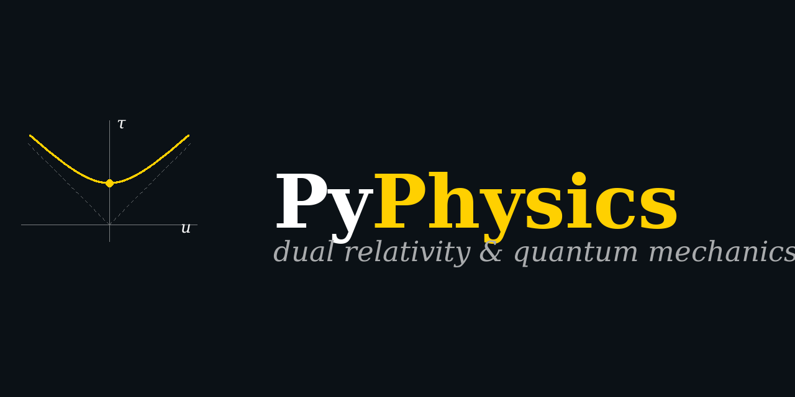

<p align="center">
  
</p>

# PyPhysics

A physics research repository centered on Tepper Gill's **dual theory of relativity and quantum mechanics**: a reformulation that uses *proper time* τ as the natural parameter, replaces the standard Hamiltonian with the positive-definite $K = H^2/(2mc^2) + mc^2/2$, and introduces the *collaborative speed* $b = \sqrt{c^2 + u^2}$ as the bridge between observer-time and proper-time frames.

The dual framework reproduces all experimentally confirmed predictions of standard SR + QM + QED within current measurement precision; the contrast with standard physics sits at the level of mathematical conventions and the interpretive consequences that follow.

## Three pillars

The repo is organised into three campaigns, each tracked as a GitHub epic:

1. **Equation verification** (issue [#3](https://github.com/temoTxt/PyPhysics/issues/3), completed in [PR #4](https://github.com/temoTxt/PyPhysics/pull/4)) — eleven Gill physics papers verified equation-by-equation via Wolfram MCP, with three findings flagged for author review. Lives in [`Roadmapping/Equation_Verification/`](Roadmapping/Equation_Verification/).

2. **Manim animations** (issue [#5](https://github.com/temoTxt/PyPhysics/issues/5), completed in [PR #6](https://github.com/temoTxt/PyPhysics/pull/6)) — 9 Manim scenes walking through the load-bearing derivations of the verification campaign at 1080p. Lives in [`Roadmapping/Animations/`](Roadmapping/Animations/).

3. **History of physics 1800–1965** (issue [#7](https://github.com/temoTxt/PyPhysics/issues/7), in progress as PRs A–K) — five historical chapters + one synthesis chapter + three forward chapters (PNT, quantum computing, fusion), each with companion Manim scenes and 3-voice podcast scripts. Lives in [`Roadmapping/History/`](Roadmapping/History/) with bibliography under [`Roadmapping/History/Bibliography/`](Roadmapping/History/Bibliography/) and converted papers under [`Roadmapping/Historical_Converted_Markdown/`](Roadmapping/Historical_Converted_Markdown/).

## Three load-bearing interpretive wins

- **Michelson–Morley without length contraction.** The dual framework's velocity duality $\mathbf{w}/c = \mathbf{u}/b$ reaches the same null prediction as standard SR without invoking length contraction as a separate kinematic postulate.

- **Klein–Gordon's negative-probability problem dissolved.** The positive-definite Hamiltonian $K = H^2/(2mc^2) + mc^2/2$ plus the square-root operator construction gives a single-particle relativistic theory with manifestly positive probability density — no spinor doubling required.

- **Dyson divergence conjecture reframed.** The KS-Hilbert organisation of QFT plus the time-ordered Feynman Operator Calculus dissolves the asymptotic-series resummation problem structurally; 12-digit agreement with standard QED on $g-2$ and Lamb shift via a different summation scheme.

## Three findings flagged for author review

Documented in [`Roadmapping/Equation_Verification/FINDINGS_for_author_review.md`](Roadmapping/Equation_Verification/FINDINGS_for_author_review.md):

1. **Maxwell paper Eq. (24)** — missing factor of $c$ + missing $V^2/(2mc^2)$ term in the spin-magnetic-field eigenvalue.
2. **DRQM I Eq. (III.22) g-factor** — published $r_e \approx 0.499857150068631\,r_0$ gives $g \approx -2.0006$; experimental $g_e \approx -2.0023$ requires $r_e \approx 0.499420510\,r_0$. The campaign's **headline payoff** — a reproducible numerical correction to a parameter in a paper the repo owner co-authored.
3. **TCEP Eq. (4.16)** — sign typo ($v_g = v_g' - v$ should be $v_g = v_g' + v$).

## Quickstart

```bash
# Paper download + PDF→markdown conversion (Python 3.14)
uv run python Roadmapping/download_paper.py
uv run python Roadmapping/parse_papers.py

# Manim animations (Python 3.13, separate sub-project)
uv sync --project Roadmapping/Animations
cd Roadmapping/Animations
uv run manim -qh --media_dir rendered manim_scenes/maxwell_eq01_02_duality.py MaxwellEq01_02Duality
```

Detailed conventions in [`CLAUDE.md`](CLAUDE.md) (repo-level guidance for Claude Code) and the per-campaign READMEs.

## Repository structure

```
.obsidian/                                   # vault config (the repo doubles as an Obsidian vault)
Roadmapping/
├── Branding/                                # logo source + raster exports (this PR)
├── Tepper_Gill_Papers/                      # 22 arxiv PDFs (Gill corpus)
├── Converted_Markdown/                      # marker-pdf output of the Gill corpus
├── Equation_Verification/                   # ⭐ the heart of the repo (PR #4)
├── Mathematica_Notebooks/                   # .wl files runnable independent of MCP
├── Animations/                              # Manim scenes (PR #6 + history-campaign scenes)
├── Historical_Papers/                       # PDFs for the history campaign
├── Historical_Converted_Markdown/           # marker-pdf output of the history corpus
└── History/                                 # history-of-physics multi-chapter project (issue #7)
    ├── Bibliography/                        # YAML-frontmatter cite cards
    ├── Forward/                             # forward-looking chapters (Ch 7–9)
    ├── Podcast/                             # 3-voice dialogue scripts per chapter
    └── _tools/                              # per-chapter helpers (validators, status, indexes)
```

## Branding

Logo + raster exports live in [`Roadmapping/Branding/`](Roadmapping/Branding/). The logo is the 4-velocity hyperboloid $b^2 - u^2 = c^2$ — the algebraic seed of the dual framework. Regeneratable via:

```bash
uv run python Roadmapping/Branding/build_logo.py
```

Available variants:
- `logo.svg` / `logo_dark.svg` / `logo_light.svg` — symbol-only SVG
- `logo_horizontal_dark.svg` / `logo_horizontal_light.svg` — symbol + "PyPhysics" wordmark
- `logo_32.png` / `logo_64.png` / `logo_256.png` — favicon ladder
- `social_preview_1280x640.png` — GitHub social preview
- `podcast_cover_3000.png` — Apple Podcasts cover art (≥3000²)

## Repo owner

[Trey Morris](https://github.com/temoTxt) — co-author of *Dual Relativistic Quantum Mechanics I* (Gill, Morris, & Kurtz, 2021). Findings concerning that paper are framed as "for author review" rather than corrections, since they go back to the original author team for response.
